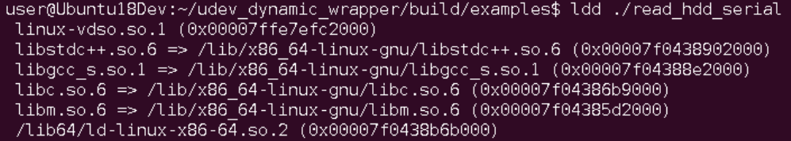

# udev_dynamic_wrapper
Wrapper for libudev functions which loads libudev.so dynamically in runtime
Dependency-injection based module which loads libudev completely dynamically with dlopen/dlsym, without necessary for link dependency to app or library or include <libudev.h>

## Advantages of dynamic loading
For example, your app uses libudev with regular static linking

```cpp
#include <libudev.h>   // This is necessary

int main() {
  ...
  struct udev *ud = udev_new();
  ...
}

```
In this case:
- package *libudev-dev* is required for build app for libudev.h
- after build, the module has a direct dependency on *libudev.so.XX* binary, where XX is libudev version. The problem will occur on another machine, where Libudev may be a different version, or completely absent. Often your software can handle the situation when libudev is unavailable, but with static linking it won't even start



With dynamic linking via wrapper you can work with different versions of libdev, and also handle situations in the code when it is not available. Package *libudev-dev* is not needed for the build

```cpp
#include "dynamic_modules_loader.h"
#include "udev_module_provider.h" // No need to use libudev.h anywhere

int main() {
  std::shared_ptr<IDynamicModulesLoader> dynamic_modules_loader = CreateDynamicModulesLoader();
  std::shared_ptr<IUdevModuleProvider> udev_mod(new UdevModuleProvider(dynamic_modules_loader, false));
  if (!udev_mod->Load()) {
    std::cerr << "LIBUDEV was not loaded" << std::endl;  // Handle situation when libudev.so is not available
    return 254;
  }

  ...
  struct IUdevModuleProvider::udev *ud = udev_mod->udev_new();
  ...
}

```

There is no direct link to libudev now:


Application can also work with all the functions of the libudev library through the wrapper, but also handle situations when libudev cannot be loaded


## How to build
```
mkdir build
cd build
cmake ..
make -j
```
Small library and example will be generated.
For link wrapper to your project, just add -ludev_dynamic_wrapper.

## How to use
Just replace your calls to udev_xxx functions to wrapper: udev_mod->udev_new(), udev_mod->udev_device_new_from_devnum()


```cpp
#include "dynamic_modules_loader.h"
#include "udev_module_provider.h"

std::string get_hdd_serial_number(std::shared_ptr<IUdevModuleProvider> udev_mod, const std::string& disk_dev_path) {
  std::string serial_number;
  struct IUdevModuleProvider::udev *ud      = NULL;
  struct stat statbuf;
  struct IUdevModuleProvider::udev_device *device  = NULL;
  struct IUdevModuleProvider::udev_list_entry *entry   = NULL;

  ud = udev_mod->udev_new();
  if (NULL == ud) 
    return serial_number;

  if (0 != stat(disk_dev_path.c_str(), &statbuf))
    return serial_number;

  device = udev_mod->udev_device_new_from_devnum(ud, 'b', statbuf.st_rdev);
  if (NULL == device) 
    return serial_number;
      
  entry = udev_mod->udev_device_get_properties_list_entry(device);
  while (NULL != entry) {
    if (0 == strcmp(udev_mod->udev_list_entry_get_name(entry),"ID_SERIAL")) 
      break;

    entry = udev_mod->udev_list_entry_get_next(entry);
  }

  serial_number = udev_mod->udev_list_entry_get_value(entry);

  udev_mod->udev_device_unref(device);
  udev_mod->udev_unref(ud);

  return serial_number;
}


```
